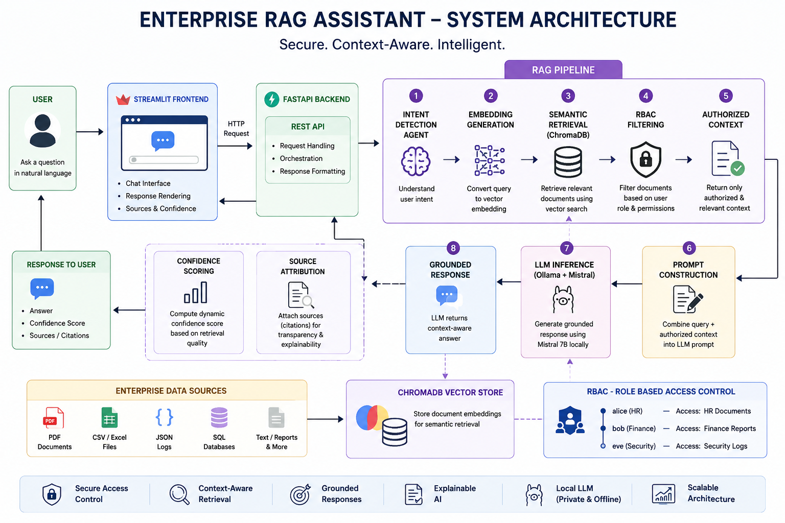
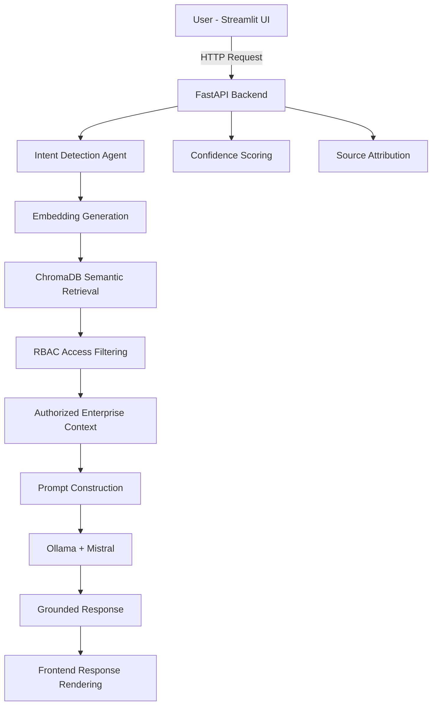

<h1 align="center">
  🏢 Enterprise RAG Assistant
</h1>

<p align="center">
  <strong>
    A secure, context-aware enterprise AI assistant powered by RAG, RBAC, semantic search, and local LLMs.
  </strong>
  <br/>
  Not just a chatbot — an enterprise-grade AI system that securely retrieves and reasons across disconnected enterprise data silos.
</p>

<p align="center">
  
  
  
  
  
  
  
  
  
</p>

---

<p align="center">
  <a href="https://www.youtube.com/watch?v=7JZyZ4pIJAc">
    
  </a>
  <br/>
  <a href="https://www.youtube.com/watch?v=7JZyZ4pIJAc">
    ▶ Watch Demo Video
  </a>
</p>

---

## 🏗️ Architecture Diagram

<p align="center">
  
</p>

---

# 🧠 Why Enterprise RAG Assistant?

Modern enterprises store critical information across disconnected systems:

- PDFs & internal documents
- SQL/CSV databases
- JSON logs & audit trails
- Technical reports
- Compliance records
- Operational datasets

Traditional enterprise search systems:
- rely on keyword matching
- lack contextual understanding
- cannot enforce intelligent access control
- often hallucinate responses

## Enterprise RAG Assistant is different.

It combines:
- Retrieval-Augmented Generation (RAG)
- Semantic vector search
- Role-Based Access Control (RBAC)
- Context-aware orchestration
- Local LLM inference using Ollama + Mistral

The system retrieves only authorized enterprise context before generation, ensuring grounded, explainable, and secure responses.

> Built as a portfolio + hackathon project to demonstrate enterprise AI system design using RAG pipelines, vector databases, RBAC security, orchestration logic, and local LLM deployment.

---

# ✨ Features

## 🔍 Intelligent Semantic Retrieval

The assistant performs semantic retrieval across enterprise datasets using vector embeddings.

### Capabilities

- Semantic enterprise search
- Cross-source retrieval
- Query-aware context fetching
- Multi-format document understanding
- Retrieval across disconnected silos

---

## 🔐 Role-Based Access Control (RBAC)

Enterprise security is enforced BEFORE context reaches the LLM.

Users can only retrieve authorized documents.

### Example Access Control

| User | Allowed Access |
|---|---|
| alice | HR documents |
| bob | Finance reports |
| eve | Security audit logs |

Unauthorized access is blocked during retrieval itself.

---

## 🧠 Context-Aware RAG Pipeline

The system retrieves only relevant enterprise context before generation.

### RAG Flow

1. User submits natural language query
2. Query converted into vector embeddings
3. ChromaDB performs semantic similarity search
4. RBAC filters unauthorized documents
5. Authorized context injected into prompt
6. Mistral generates grounded response

This minimizes hallucination and prevents enterprise data leakage.

---

## ⚙️ Intent Detection Agent

A lightweight orchestration layer detects user intent before retrieval.

### Example Intents

| Query | Detected Intent |
|---|---|
| What is the leave policy? | HR |
| Show Q1 revenue | Finance |
| Failed login attempts | Security |

This improves retrieval accuracy and explainability.

---

## 📚 Explainability & Citations

Every response includes:
- Retrieved document sources
- Retrieval traceability
- Confidence scoring

### Example Response

```text
━━━━━━━━━━━━━━━━━━━━━━━━━━━━━━

🔷 ENTERPRISE RAG RESPONSE

📌 Intent: HR

🧠 Answer:
Employees receive 20 annual leave days annually.
Managers must approve all leave requests.

📊 Confidence Score: 87%

📚 Sources:
hr_policy.pdf

━━━━━━━━━━━━━━━━━━━━━━━━━━━━━━
```

---

## 📊 Dynamic Confidence Scoring

Confidence scores are dynamically computed using:
- semantic similarity
- retrieval quality
- strongest document match

This provides transparency into answer reliability.

---

## 🛡️ Hallucination Reduction

Strict enterprise prompts ensure:
- grounded responses
- no external knowledge usage
- no unauthorized inference
- factual enterprise-safe answers

---

## 💻 Local LLM Deployment

Runs completely local using:
- Ollama
- Mistral 7B

### Benefits

- No API cost
- Offline capability
- Enterprise privacy
- No cloud dependency

---

# 🏗️ System Architecture



---

# 🔄 End-to-End Workflow

| Step | What Happens |
|---|---|
| 1 | User submits enterprise query |
| 2 | Frontend sends query to FastAPI |
| 3 | Intent detection agent classifies query |
| 4 | Query converted into embeddings |
| 5 | ChromaDB performs semantic retrieval |
| 6 | RBAC filters unauthorized documents |
| 7 | Authorized context injected into prompt |
| 8 | Ollama runs Mistral locally |
| 9 | Grounded response generated |
| 10 | Confidence score calculated |
| 11 | Sources attached |
| 12 | Frontend renders final response |

---

# 🛠️ Tech Stack

| Layer | Technology | Why |
|---|---|---|
| Frontend | Streamlit | Fast interactive AI demo UI |
| Backend | FastAPI | Lightweight async backend API |
| LLM | Ollama + Mistral | Local enterprise-grade inference |
| Vector Store | ChromaDB | Semantic similarity retrieval |
| Embeddings | Sentence Transformers | Text-to-vector conversion |
| Retrieval Architecture | RAG | Context-grounded generation |
| Security | RBAC | Enterprise access control |
| Language | Python | Core application logic |

---

# 📁 Project Structure

```text
enterprise-rag/
├── backend/
│   ├── main.py
│   ├── rag_pipeline.py
│   ├── ingest.py
│   ├── auth.py
│
├── frontend/
│   └── app.py
│
├── data/
│   ├── hr_policy.pdf
│   ├── finance_report.csv
│   ├── security_logs.json
│
├── assets/
│   ├── architecture.png
│   └── demo.gif
│
├── requirements.txt
├── README.md
└── .gitignore
```

---

# 🚀 Getting Started

## Prerequisites

- Python 3.10+
- Ollama installed locally
- Mistral model pulled locally

```bash
ollama pull mistral
```

---

## 1. Clone Repository

```bash
git clone https://github.com/v-vinci13/enterprise-rag-assistant.git

cd enterprise-rag-assistant
```

---

## 2. Create Virtual Environment

```bash
# Mac/Linux
python3 -m venv .venv

source .venv/bin/activate

# Windows
python -m venv .venv

.venv\Scripts\activate
```

---

## 3. Install Dependencies

```bash
pip install -r requirements.txt
```

---

## 4. Ingest Enterprise Data

```bash
cd backend

python ingest.py
```

This populates ChromaDB with enterprise embeddings.

---

## 5. Start Backend

```bash
uvicorn main:app --reload
```

---

## 6. Start Frontend

Open another terminal:

```bash
cd frontend

streamlit run app.py
```

Open:

```text
http://localhost:8501
```

---

# 🎯 Example Queries

## HR

```text
What is the leave policy?
```

## Finance

```text
What is the Q1 revenue report?
```

## Security

```text
Show failed login attempts
```

---

# 🔐 Example RBAC Behavior

| User Query | Result |
|---|---|
| alice asking HR question | Allowed |
| alice asking finance question | Denied |
| bob asking finance question | Allowed |
| eve asking security logs | Allowed |

Unauthorized requests are blocked before generation reaches the LLM.

---

# 🎯 Key Design Decisions

## Why RAG?

Enterprise datasets are large and fragmented.

RAG retrieves only relevant context:
- improves scalability
- reduces hallucination
- improves accuracy

---

## Why RBAC Before Generation?

Security filtering occurs BEFORE prompt construction.

This prevents:
- unauthorized retrieval
- prompt leakage
- indirect hallucinated exposure

---

## Why Local LLMs?

Using Ollama + Mistral:
- avoids API cost
- improves enterprise privacy
- enables offline AI deployment
- demonstrates local inference capability

---

## Why ChromaDB?

ChromaDB provides:
- lightweight vector storage
- fast semantic retrieval
- easy local deployment
- ideal hackathon scalability

---

# ⚖️ Trade-offs & Limitations

| Decision | Trade-off |
|---|---|
| Local LLM | Depends on local hardware |
| ChromaDB local storage | Not distributed |
| Rule-based intent detection | Limited orchestration intelligence |
| Synthetic enterprise data | Demo-scale dataset |
| Lightweight RBAC | Not production-grade IAM |

---

# 🔮 Future Improvements

- [ ] Enterprise SSO integration
- [ ] Multi-user authentication
- [ ] Hybrid search (BM25 + semantic)
- [ ] Multi-agent orchestration
- [ ] Advanced audit logging
- [ ] Real-time streaming responses
- [ ] Cloud deployment
- [ ] Page-level PDF citations

---

# 🧪 System Design Summary

> *"Enterprise RAG Assistant combines semantic retrieval, RBAC security, and local LLM orchestration to provide grounded, secure, and context-aware enterprise question answering across disconnected data silos."*

## Core Concepts Demonstrated

- Retrieval-Augmented Generation (RAG)
- Semantic vector search
- Enterprise RBAC security
- Local LLM deployment
- Context-aware orchestration
- Explainable AI systems
- Multi-source enterprise retrieval

---

# 👩‍💻 Author

## Varsha Shukla

Built with Python, semantic search, local LLMs, and too many late-night debugging sessions.

---

# 📄 License

This project is licensed under the [MIT License](./LICENSE).

---

<p align="center">
  ⭐ If you found this project interesting, consider starring the repository!
</p>
